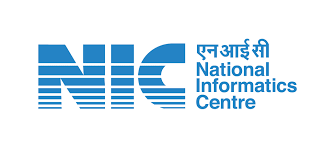

<!DOCTYPE html>
<html lang="en">
<head>
    <meta charset="UTF-8">
    <meta name="viewport" content="width=device-width, initial-scale=1.0">
</head>
<body>
    <svg xmlns="http://www.w3.org/2000/svg">
        <foreignObject width="100%" height="100%">
            

                

                    

 <h1 style="color: #0056b3;">FAQ Chatbot Project at NIC Tripura</h1>

                        <h2 style="color: #0056b3;">Overview</h2>
                        
Welcome to the repository for the FAQ Chatbot Project developed during my internship at NIC Tripura. This project leverages the power of the Phi-2 Large Language Model (LLM), Python, and PostgreSQL to create an intelligent FAQ chatbot. The chatbot is designed to handle queries related to DBT (Direct Benefit Transfer) transactions for scholarships and other gratuities.

                    

   

                        <h2 style="color: #0056b3;">Project Duration</h2>
                        
<strong>Internship Period:</strong> 15th May - 30th June

                    

  

                        <h2 style="color: #0056b3;">Project Description</h2>
                        <h3 style="color: #0056b3;">Objective</h3>
                        
The primary goal of this project was to streamline the process of answering frequently asked questions related to DBT transactions. By implementing an AI-driven chatbot, we aimed to provide instant, accurate, and reliable responses to users, thereby enhancing user experience and reducing the workload on administrative staff.

    <h3 style="color: #0056b3;">Technology Stack</h3>
                        <ul>
                            <li><strong>Phi-2 LLM:</strong> Utilized for natural language understanding and generating accurate responses.</li>
                            <li><strong>Python:</strong> The core programming language used to develop the chatbot.</li>
                            <li><strong>PostgreSQL:</strong> Employed for storing and managing the dataset of DBT transactions.</li>
                        </ul>
     <h3 style="color: #0056b3;">Dataset</h3>
                        
The chatbot was trained on a comprehensive dataset consisting of DBT transaction records related to scholarships and other gratuities. This dataset enabled the chatbot to understand and respond to a wide range of queries effectively.

    <h3 style="color: #0056b3;">Key Features</h3>
                        <ul>
                            <li><strong>Intelligent Query Handling:</strong> The chatbot can understand and respond to a variety of questions related to DBT transactions.</li>
                            <li><strong>Instant Responses:</strong> Provides immediate answers, improving the efficiency of user interactions.</li>
                            <li><strong>User-Friendly Interface:</strong> Designed to be intuitive and easy to use for individuals with varying levels of technical expertise.</li>
                        </ul>
                    

   

                        <h2 style="color: #0056b3;">Experience at NIC Tripura</h2>
                        
My internship at NIC Tripura was an enriching experience. Working on this project allowed me to:

                        <ul>
                            <li><strong>Enhance Technical Skills:</strong> I gained hands-on experience with Phi-2 LLM, Python, and PostgreSQL.</li>
                            <li><strong>Collaborate with Experts:</strong> I had the opportunity to work alongside experienced professionals who provided invaluable guidance.</li>
                            <li><strong>Contribute to a Meaningful Cause:</strong> By developing this chatbot, I contributed to improving the efficiency of public services related to scholarship disbursements and gratuities.</li>
                        </ul>
                    

  

                        <h2 style="color: #0056b3;">Challenges and Learning</h2>
                        <h3 style="color: #0056b3;">Challenges</h3>
                        <ul>
                            <li><strong>Data Cleaning:</strong> Handling and cleaning large datasets to ensure accurate chatbot responses.</li>
                            <li><strong>Model Training:</strong> Fine-tuning the Phi-2 LLM to handle domain-specific queries effectively.</li>
                            <li><strong>Integration:</strong> Ensuring seamless integration between the chatbot, the database, and the user interface.</li>
                        </ul>
    <h3 style="color: #0056b3;">Learning</h3>
                        <ul>
                            <li><strong>Data Science:</strong> Enhanced understanding of data preprocessing, model training, and evaluation.</li>
                            <li><strong>Software Development:</strong> Improved skills in Python programming and database management.</li>
                            <li><strong>Problem-Solving:</strong> Developed effective strategies to tackle real-world problems in a professional setting.</li>
                        </ul>
                    

                    

                        <h2 style="color: #0056b3;">Future Enhancements</h2>
                        <ul>
                            <li><strong>Expand Dataset:</strong> Incorporate additional data sources to improve the chatbot's knowledge base.</li>
                            <li><strong>Multi-Language Support:</strong> Enable the chatbot to handle queries in multiple languages.</li>
                            <li><strong>Advanced Analytics:</strong> Implement analytics to monitor chatbot performance and user interactions.</li>
                        </ul>
                    

  

                        <h2 style="color: #0056b3;">Acknowledgments</h2>
                        
I would like to extend my gratitude to NIC Tripura for providing me with this incredible opportunity. Special thanks to my mentors and team members for their support and encouragement throughout the project.
 

                        
For any queries or further information, feel free to reach out to me at <a href="mailto:das201706@gmail.com">Email</a>

                    

                

            

        </foreignObject>
    </svg>
</body>
</html>
